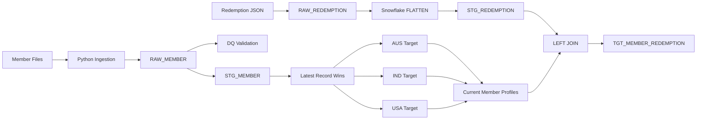

# Airline Loyalty Data Engineering Pipeline

A data engineering solution for the Incubyte Data Craftsperson assessment. It processes country-specific member spreadsheets and semi-structured airline redemption JSON using Python and Snowflake.

## Architecture



## Project Structure

```text
assessment/     Assessment files and sample inputs
sql/            Snowflake DDL and transformation SQL
src/            Python ingestion and orchestration
tests/          Automated tests
docs/           Architecture and design documentation
```

## Data Layers

**Raw:** `RAW_MEMBER`, `RAW_REDEMPTION`

**Staging:** `STG_MEMBER`, `STG_REDEMPTION`

**Data quality:** `DQ_MEMBER_VALIDATION`

**Targets:** `TGT_MEMBER_AUS`, `TGT_MEMBER_IND`, `TGT_MEMBER_USA`, `TGT_MEMBER_REDEMPTION`

## Key Transformations

### Member data

- Map country-specific source columns into a canonical member structure.
- Preserve raw date values, then parse supported formats in Snowflake.
- Calculate completed age and whether the last flight was more than 90 days ago.
- Validate raw records and retain findings with batch/source lineage.
- Select the latest staged record per `(member_id, member_name)` and route it by country.

### Redemption data

- Preserve the original JSON document in a Snowflake `VARIANT` column.
- Flatten the nested array into one row per transaction with `LATERAL FLATTEN`.
- Left-join transactions to current profiles so unmatched redemptions are retained.

The redemption feed contains only `member_id`; duplicate numeric IDs across countries can make a profile join ambiguous. See [docs/design_decisions.md](docs/design_decisions.md) for this and other assumptions/limitations.

## Environment Setup

From the project root, create and activate a virtual environment in PowerShell:

```powershell
python -m venv .venv
.\.venv\Scripts\Activate.ps1
python -m pip install -r requirements.txt
```

Create a local `.env` using `.env.example` as a template and fill in the Snowflake account, user, password, warehouse, database, and schema values. Keep `.env` private; it is excluded from Git.

## Run Tests

With the project environment activated:

```powershell
python -m pytest -q
```

## Pipeline Execution

Snowflake DDL under `sql/` must be run in the configured database/schema before the corresponding loaders, except where a Python runner executes the SQL file itself. Typical module commands, run from the project root:

```powershell
python -m src.ingest_members
python -m src.load_raw_members
python -m src.load_staging_members
python -m src.validate_members
python -m src.load_country_targets
python -m src.load_redemptions
python -m src.flatten_redemptions
python -m src.build_member_redemptions
```

Run setup DDL in dependency order: `01_raw_member.sql`, `02_staging_member.sql`, `04_member_dq_validation.sql`, `06_country_target_tables.sql`, `08_raw_redemption.sql`, and `09_staging_redemption.sql`. The Python staging, DQ, country-target, flattening, and member-redemption runners execute their corresponding transformation SQL files.

Loaders that append raw data can insert another batch when rerun. Curated target scripts currently clear and rebuild their output. Check the Snowflake table counts and records after execution; local unit tests do not execute the Snowflake SQL.

## Design Principles

- Preserve source representations and lineage.
- Validate before publishing curated records.
- Keep data-intensive work inside Snowflake.
- Make business rules testable locally.
- Make assumptions and identity limitations explicit.
- Use incremental, bulk, and idempotent approaches when adapting the sample pipeline for production-scale volumes.

See [docs/architecture.md](docs/architecture.md) and [docs/design_decisions.md](docs/design_decisions.md) for details.
