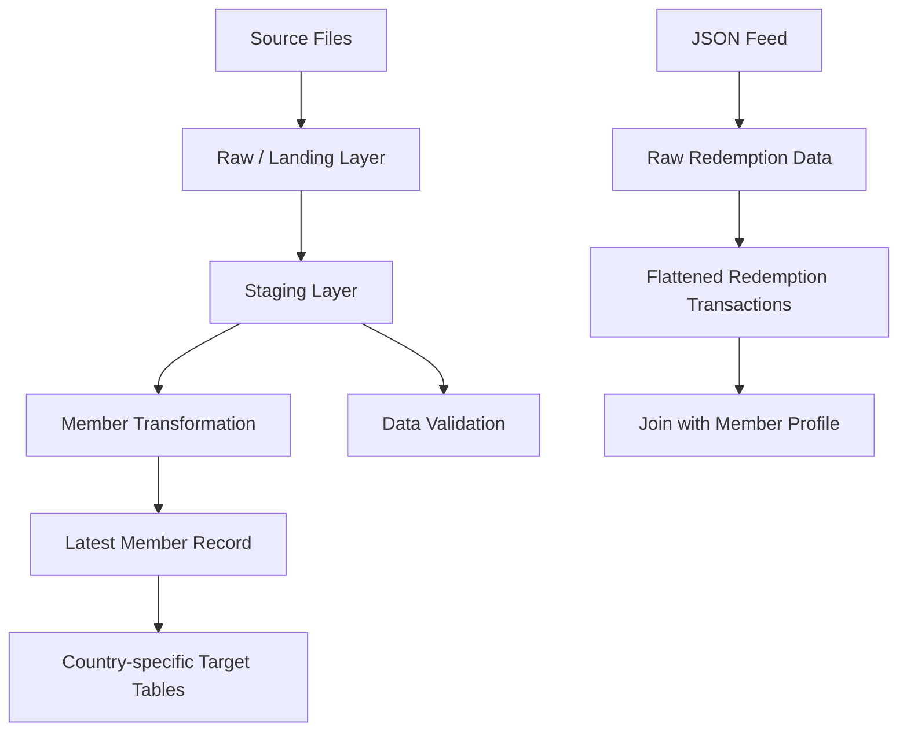

# Data Pipeline Architecture

## 1. Overview

The solution follows a layered data pipeline design:



## 2. Processing Layers

### Raw / Landing Layer

The raw layer stores data as close to the source representation as practical.

The purpose of this layer is to:

- Preserve source data for traceability.
- Support reprocessing when transformation logic changes.
- Maintain source-file and ingestion metadata.
- Prevent source issues from being silently hidden.

Typical audit columns include:

- source_file
- ingestion_timestamp
- ingestion_batch_id

The raw layer should be append-oriented so that previous loads can be traced.

### Staging Layer

The staging layer provides a standardized member structure across the different source formats.

Source-specific column names are mapped into common business names.

Example:

| Source Field | Canonical Field |
|---|---|
| Unique ID / ID | member_id |
| Member Name / Name | member_name |
| Tier Type / TierCode | tier_code |
| Date of Birth / DOB | dob |
| Date of Enrollment / EnrollmentDate | enrollment_date |
| Date of Flight / Flight Date / FlightDate | last_flight_date |

Additional derived fields are calculated in staging:

- age
- stale_member

The staging layer is also where source values are standardized and validated.

### Target Layer

After validation and transformation, the latest member record is written to the appropriate country-specific target table.

Examples:

- target_member_india
- target_member_australia
- target_member_usa

The target layer represents the current member state rather than every historical source record.

## 3. Canonical Member Model

The staging and target layers will use a common member model.

| Column | Type | Description |
|---|---|---|
| member_id | VARCHAR(18) | Business identifier for the member |
| member_name | VARCHAR(255) | Member name |
| enrollment_date | DATE | Date the member enrolled |
| last_flight_date | DATE | Most recent flight date available from the source |
| tier_code | VARCHAR(5) | Member tier |
| agent_name | VARCHAR(255) | Agent associated with the member |
| state | VARCHAR(5) | State/region |
| country | VARCHAR(5) | Standardized country code |
| post_code | VARCHAR(10) | Postal code |
| dob | DATE | Date of birth |
| active_member | VARCHAR(1) | Active member indicator |
| age | INTEGER | Derived age |
| stale_member | BOOLEAN | Indicates whether flight is more than 90 days old |
| source_file | VARCHAR(255) | Source file name |
| ingestion_timestamp | TIMESTAMP | Time the record was ingested |
| ingestion_batch_id | VARCHAR(100) | Identifier for the ingestion batch |

Some attributes are not available in every source file. Missing optional attributes will be represented as NULL.

## 4. Why Member ID Is Stored as VARCHAR

Although the sample files contain numeric-looking IDs, the assessment defines Member ID as a VARCHAR field.

The pipeline will therefore treat member_id as a business identifier rather than a numeric measure.

This also avoids losing leading zeroes if they appear in future source data.

## 5. Country Handling

The assessment's source specification includes Country as a member attribute.

The sample Excel files are country-specific and do not contain a country column.

For these sample files, the ingestion configuration will associate:

- AUS.xlsx -> AUS
- IND.xlsx -> IND
- USA.xlsx -> USA

For the generic source feed described in the assessment, the Country field supplied by the source will be used.

The country value will be standardized before loading the country-specific target.

## 6. Latest Record Wins

A member can appear in multiple source records and potentially move between countries.

The target tables should contain the latest applicable record for that member.

For example:

| Member ID | Country | Last Flight Date |
|---|---|---|
| 1 | USA | 2021-12-30 |
| 1 | AUS | 2022-08-01 |

The AUS record is more recent and therefore becomes the current member record.

The transformation will use a window function such as:

```sql
ROW_NUMBER() OVER (
    PARTITION BY member_id
    ORDER BY last_flight_date DESC
)
```

The record with `ROW_NUMBER() = 1` becomes the current record.

If the business date is unavailable, the design should fall back to an appropriate source/ingestion timestamp rather than arbitrarily selecting a record.

The exact fallback logic will be implemented in the transformation layer.

## 7. Age Calculation

Age will be derived from Date of Birth.

The calculation should consider whether the member has already had their birthday in the current year rather than simply subtracting the birth year from the current year.

If DOB is unavailable, age will remain NULL.

Invalid DOB values will be captured by data-quality validation.

## 8. Stale Member Calculation

A member is considered stale when the number of days since the available Last Flight Date is greater than 90 days.

Conceptually:

```text
Current Date - Last Flight Date > 90
```

Result:

```text
TRUE  -> stale member
FALSE -> active from a flight-recency perspective
NULL  -> no flight date available
```

The implementation will avoid treating a missing flight date as automatically stale.

## 9. Redemption Processing

The redemption feed contains a member_id and a nested list of redemption transactions.

The JSON structure will be flattened into one row per redemption transaction.

Example:

```text
member_id
feed_date
txn_id
txn_date
partner
miles_redeemed
status
```

The transaction identifier (`txn_id`) will be treated as the transaction-level key.

The flattened redemption table can then be joined to the member profile using:

```text
redemption.member_id = member.member_id
```

This keeps member attributes and transaction-level attributes separate and avoids duplicating the member profile unnecessarily.

## 10. Data Quality Strategy

The pipeline will perform validation for:

### Mandatory fields

- member_name
- member_id
- enrollment_date

### Key uniqueness

- member_id uniqueness within the applicable current-member dataset
- txn_id uniqueness within redemption transactions

### Date validation

- valid date format
- enrollment date should not contain impossible calendar values
- DOB should not be in the future
- flight date should be checked against relevant business dates

### Data consistency

Examples include:

- unexpected country codes
- unsupported tier codes
- invalid active-member flags
- invalid member identifiers
- duplicate records
- inconsistent records across country files

### Traceability

Invalid records should not disappear silently.

They should be identifiable using source metadata such as:

- source_file
- ingestion_batch_id
- ingestion_timestamp

## 11. Handling Invalid Records

The pipeline should distinguish between:

1. Valid records that can continue through the pipeline.
2. Invalid records that should be rejected or quarantined.
3. Valid records with missing optional attributes.

For example, an invalid date such as:

```text
2021-13-13
```

should not be silently converted to another date.

The original source record should remain traceable so that the issue can be investigated or corrected at the source.

## 12. Scalability Considerations

The assessment states that the process should consider billions of records per day.

The design therefore favors:

- Set-based SQL transformations.
- Incremental processing instead of unnecessary full reloads.
- Append-oriented raw ingestion.
- Efficient deduplication using window functions.
- Processing only required columns.
- Bulk file loading.
- Separate validation/error handling.
- Idempotent processing where possible.
- Audit metadata for operational traceability.

Country-specific target tables should be populated from the deduplicated current-member dataset rather than repeatedly scanning the raw source.

## 13. Operational Logging

The Python processing layer will use structured application logging for operational events such as:

- Starting a file ingestion.
- Number of records read.
- Number of valid records.
- Number of rejected records.
- Number of duplicate records.
- Transformation completion.
- Redemption records processed.
- Processing failures.

Logging should provide enough information to troubleshoot a batch without exposing sensitive member information unnecessarily.

## 14. Design Principle

The main principle of the pipeline is:

```text
Preserve -> Validate -> Standardize -> Transform -> Publish
```

The raw layer provides traceability, the staging layer provides a consistent business model, and the target layer provides data that is ready for downstream consumption.
