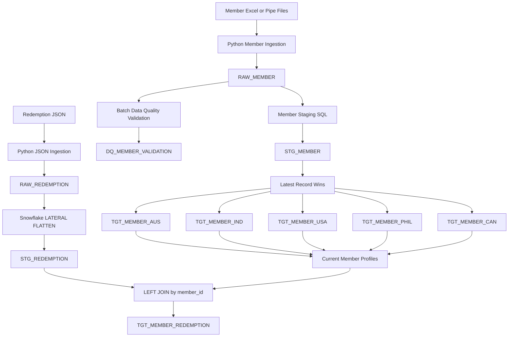
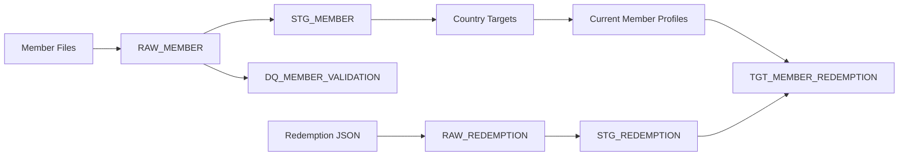

# Data Engineering Architecture

## 1. Overview

The solution uses Python for source-file handling and orchestration, and Snowflake for storage and set-based transformation. It supports the supplied country-specific Excel samples and the assessment's header/detail pipe-delimited member layout, plus a semi-structured JSON redemption feed.

## 2. End-to-End Architecture



## 3. Pipeline Layers

### Raw layer

Raw tables preserve source data and batch lineage:

- `RAW_MEMBER` stores canonical member fields, including agent, state, postal code, and active-member values. Raw date and postal-code values are strings so malformed values remain available for validation.
- `RAW_REDEMPTION` stores the original JSON payload in a Snowflake `VARIANT` column.

Both paths retain source-file and ingestion metadata, including `ingestion_batch_id` and `ingestion_timestamp`.

### Staging layer

The member staging transformation maps ISO, timestamp-like, `YYYYMMDD`, and `MMDDYYYY` enrollment, flight, and DOB values to dates; derives numeric postal code, completed age, and the greater-than-90-days `stale_member` flag; and retains lineage columns. Rows with missing member ID/name, invalid enrollment date, or unsupported country are excluded from `STG_MEMBER`.

The redemption staging transformation uses `LATERAL FLATTEN` to emit one row per object in the JSON `redemptions` array. Feed and transaction dates are parsed from `YYYYMMDD` strings.

### Data quality layer

`DQ_MEMBER_VALIDATION` stores validation findings, not duplicate copies of source records. The Python runner selects the latest raw ingestion batch and executes validations against `RAW_MEMBER`, allowing records excluded from staging to remain visible.

Current SQL rules cover missing member ID/name, missing or invalid enrollment date, invalid flight date, invalid or future DOB, enrollment after flight, unsupported country, duplicate member names (the assessment-declared key), and duplicate `(country, member_id)` source keys within a batch. Findings retain batch and source-file lineage. The validator selects the newest batch by `MAX(ingestion_timestamp)` and replaces that batch's previous findings before rerunning validation.

The spreadsheet sample repeats the name `Mike` across two countries with different IDs. The DQ rule reports both rows per the PDF's declared Member Name key, staging excludes all same-batch duplicate-name rows, and the country-target snapshot also excludes names flagged by the newest DQ batch so older staging history cannot re-publish them. This is conservative: if the two Mikes are distinct people, the source must provide an immutable key before they can safely be promoted.

### Member target layer

`STG_MEMBER` is deduplicated using `ROW_NUMBER()` partitioned by normalized `member_name`, matching the assessment's declared key. The row with the latest `ingestion_timestamp` wins, with enrollment date and source file as tie-breakers. Same-batch duplicate names are filtered before staging and excluded from the target snapshot based on current-batch DQ findings. The winning row is routed to `TGT_MEMBER_AUS`, `TGT_MEMBER_IND`, `TGT_MEMBER_USA`, `TGT_MEMBER_PHIL`, or `TGT_MEMBER_CAN` according to its normalized country. For the supplied workbooks, current targets contain 6 records: AUS 1, IND 3, USA 2.

The country targets are cleared and rebuilt by the current load script, making a complete rerun deterministic for the current staged dataset.

### Redemption/member target layer

The current profile set is formed from all five country targets. Only member IDs appearing exactly once across those targets are eligible for enrichment. `STG_REDEMPTION` is left-joined to that set on `member_id`, and the result is written to `TGT_MEMBER_REDEMPTION`. The left join preserves transactions without a unique matching profile; profile attributes are then `NULL`, avoiding row multiplication or arbitrary profile selection.

The redemption feed has no country or member name, while the sample country files reuse numeric IDs. A non-unique ID is therefore deliberately treated as unmatched. The sample redemption ID (`223457`) has no current profile match, so its two transactions remain unmatched. Production use requires an authoritative cross-source member key, or enough redemption identity fields to disambiguate the profile.

## 4. Latest Record Wins

The source specification has no authoritative update timestamp, so `ingestion_timestamp` is used as the recency indicator:

```sql
ROW_NUMBER() OVER (
    PARTITION BY UPPER(TRIM(member_name))
    ORDER BY
        ingestion_timestamp DESC,
        enrollment_date DESC NULLS LAST,
        source_file DESC
)
```

Member Name is the key specified by the PDF, so latest selection uses its trimmed, case-normalized value. Same-batch duplicate names are rejected from staging and retained in RAW/DQ. The repeated `Mike` values may be two distinct people, so this conservative policy excludes both until the source owner supplies an immutable global member key. If an authoritative source update/effective timestamp becomes available, it should take precedence over ingestion time.

## 5. Redemption JSON Processing

A raw feed contains a member ID, feed date, and a nested array of redemption transactions. The original payload is retained in `RAW_REDEMPTION` as `VARIANT`. Snowflake `LATERAL FLATTEN` converts each array element into a transaction row in `STG_REDEMPTION`, including transaction ID/date, partner, miles, and status.

For the supplied sample, one raw JSON payload contains two redemptions and produces two staging rows.

## 6. Python and Snowflake Responsibilities

Python handles file reading, source configuration, batch IDs, logging, invoking SQL, and transaction/error orchestration. Snowflake handles date conversion, derived fields, validation queries, window functions, JSON flattening, country routing, and joins. Keeping data-intensive work in Snowflake avoids transferring large datasets through Python.

## 7. Error Handling and Lineage

Loaders log progress and failures, explicitly disable autocommit for DML units, commit successful operations, roll back on exceptions, and re-raise errors. Member and redemption batch IDs are deterministic from source names/content; retries replace the same raw batch. Redemption ingestion also replaces an older row for the same source/member/feed-date key. Snowflake DDL can commit independently of DML transactions, so rollback should not be assumed to undo table creation or replacement. Existing-table schema updates use the additive `12_member_schema_migration.sql` rather than replacing loaded tables.

## 8. Testing Strategy

Local tests cover source mappings, supported and invalid date values, age/staleness calculations, date sequencing, latest-record selection, and matched/unmatched redemption joins. Snowflake verification queries are also required to validate actual table counts and contents; unit tests do not execute or prove the Snowflake SQL itself.

Run local tests with:

```powershell
python -m pytest -q
```

## 9. Scalability and Production Considerations

The assessment discusses very high daily volumes. The current implementation demonstrates the transformations on small Excel/JSON samples; it is not a billion-row ingestion implementation. Scaling it appropriately would require:

- Incremental ingestion and batch-scoped processing rather than rescanning historical data.
- Cloud/object storage staging and Snowflake bulk loading (for example, `COPY INTO`) instead of row-wise Python inserts.
- Idempotent `MERGE` or batch replacement strategies for raw, DQ, and curated outputs.
- Warehouse sizing and workload isolation based on measured query demand.
- Monitoring query history, load counts, rejected records, and warehouse utilization.
- Clustering only when measured access patterns and data volume justify its maintenance cost.
- Retaining only required columns through each transformation and limiting reprocessing to new or changed data.

The country targets and redemption staging/target scripts currently transactionally clear and rebuild their outputs. This is simple and repeatable for the assessment sample but should be replaced with incremental strategies at production scale. Member DQ and staging processing are batch-scoped and replace prior results for the selected batch.

## 10. Data Lineage



## 11. Implemented Scope

The project demonstrates configuration-driven Excel ingestion, parsing of the assessment pipe-delimited member layout, raw source preservation, member staging and derived attributes, batch-aware DQ SQL, latest-record country targets, JSON raw ingestion and flattening, ambiguity-safe member/redemption enrichment, local tests, and Snowflake orchestration from Python. It remains a sample-scale implementation; bulk ingestion and query-level scale validation are not demonstrated.
