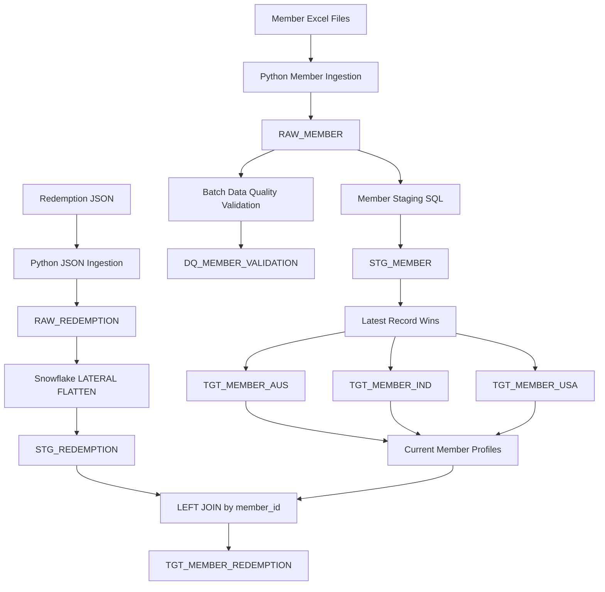
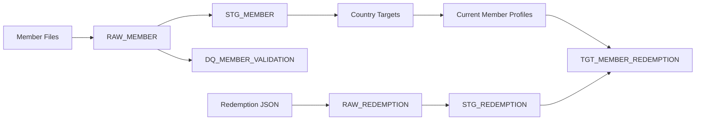

# Data Engineering Architecture

## 1. Overview

The solution uses Python for source-file handling and orchestration, and Snowflake for storage and set-based transformation. It processes country-specific member spreadsheets and a semi-structured JSON redemption feed through separate raw and staging paths, then publishes current member targets and enriched redemption transactions.

## 2. End-to-End Architecture



## 3. Pipeline Layers

### Raw layer

Raw tables preserve source data and batch lineage:

- `RAW_MEMBER` stores canonical member fields. Raw date values are strings so malformed values remain available for validation.
- `RAW_REDEMPTION` stores the original JSON payload in a Snowflake `VARIANT` column.

Both paths retain source-file and ingestion metadata, including `ingestion_batch_id` and `ingestion_timestamp`.

### Staging layer

The member staging transformation maps supported enrollment, flight, and DOB formats to dates; calculates completed age and the greater-than-90-days `stale_member` flag; and retains lineage columns. Rows missing member ID, member name, or a valid enrollment date are excluded from `STG_MEMBER`.

The redemption staging transformation uses `LATERAL FLATTEN` to emit one row per object in the JSON `redemptions` array. Feed and transaction dates are parsed from `YYYYMMDD` strings.

### Data quality layer

`DQ_MEMBER_VALIDATION` stores validation findings, not duplicate copies of source records. The Python runner selects the latest raw ingestion batch and executes validations against `RAW_MEMBER`, allowing records excluded from staging to remain visible.

Current SQL rules cover missing member ID/name, missing or invalid enrollment date, invalid flight date, invalid or future DOB, enrollment after flight, and duplicate `(country, member_id)` keys within a batch. Findings retain batch and source-file lineage.

Country-code allow-list validation is not currently implemented. Re-running validation for the same batch can append duplicate findings; production operation should make that step idempotent, for example by replacing or merging findings for the batch.

### Member target layer

`STG_MEMBER` is deduplicated using `ROW_NUMBER()` partitioned by `(member_id, member_name)`. The row with the latest `ingestion_timestamp` wins, with enrollment date and source file as tie-breakers. The winning row is routed to `TGT_MEMBER_AUS`, `TGT_MEMBER_IND`, or `TGT_MEMBER_USA` according to its country.

The country targets are cleared and rebuilt by the current load script, making a complete rerun deterministic for the current staged dataset.

### Redemption/member target layer

The current profile set is formed by `UNION ALL` over the three country targets. `STG_REDEMPTION` is left-joined to that set on `member_id`, and the result is written to `TGT_MEMBER_REDEMPTION`. The left join preserves transactions without a matching profile; profile attributes are then `NULL`.

The redemption feed has no country or member name, while the sample country files reuse numeric IDs. Therefore, joining on `member_id` alone may be ambiguous or produce multiple matches if an ID exists in multiple country targets. The sample redemption ID (`223457`) has no current profile match, so its two transactions remain unmatched. Production use requires an authoritative cross-source member key, or enough redemption identity fields to disambiguate the profile.

## 4. Latest Record Wins

The source specification has no authoritative update timestamp, so `ingestion_timestamp` is used as the recency indicator:

```sql
ROW_NUMBER() OVER (
    PARTITION BY member_id, member_name
    ORDER BY
        ingestion_timestamp DESC,
        enrollment_date DESC NULLS LAST,
        source_file DESC
)
```

This identity choice keeps different sample members with the same numeric ID and different names separate. It is an assessment assumption, not a substitute for confirming an immutable member key with the source-system owner. If an authoritative source update/effective timestamp becomes available, it should take precedence over ingestion time.

## 5. Redemption JSON Processing

A raw feed contains a member ID, feed date, and a nested array of redemption transactions. The original payload is retained in `RAW_REDEMPTION` as `VARIANT`. Snowflake `LATERAL FLATTEN` converts each array element into a transaction row in `STG_REDEMPTION`, including transaction ID/date, partner, miles, and status.

For the supplied sample, one raw JSON payload contains two redemptions and produces two staging rows.

## 6. Python and Snowflake Responsibilities

Python handles file reading, source configuration, batch IDs, logging, invoking SQL, and transaction/error orchestration. Snowflake handles date conversion, derived fields, validation queries, window functions, JSON flattening, country routing, and joins. Keeping data-intensive work in Snowflake avoids transferring large datasets through Python.

## 7. Error Handling and Lineage

Loaders log progress and failures, commit successful database operations, roll back on exceptions where supported, and re-raise errors. Raw data and metadata support investigation and replay. Snowflake DDL can commit independently of DML transactions, so rollback should not be assumed to undo table creation or replacement.

## 8. Testing Strategy

Local tests cover source mappings, supported and invalid date values, age/staleness calculations, date sequencing, latest-record selection, and matched/unmatched redemption joins. Snowflake verification queries are also required to validate actual table counts and contents; unit tests do not execute or prove the Snowflake SQL itself.

Run local tests with:

```powershell
python -m pytest -q
```

## 9. Scalability and Production Considerations

The assessment discusses very high daily volumes. The current implementation demonstrates the transformations on small Excel/JSON samples; it is not a billion-row ingestion implementation. Scaling it appropriately would require:

- Incremental ingestion and batch-scoped processing rather than rescanning historical data.
- Cloud/object storage staging and Snowflake bulk loading (for example, `COPY INTO`) instead of row-wise Python inserts.
- Idempotent `MERGE` or batch replacement strategies for raw, DQ, and curated outputs.
- Warehouse sizing and workload isolation based on measured query demand.
- Monitoring query history, load counts, rejected records, and warehouse utilization.
- Clustering only when measured access patterns and data volume justify its maintenance cost.
- Retaining only required columns through each transformation and limiting reprocessing to new or changed data.

The country targets and redemption staging/target scripts currently clear and rebuild their outputs. This is simple and repeatable for the assessment sample but should be replaced with incremental strategies at production scale.

## 10. Data Lineage



## 11. Implemented Scope

The project demonstrates configuration-driven member ingestion, raw source preservation, member staging and derived attributes, batch-aware DQ SQL, latest-record country targets, JSON raw ingestion and flattening, member/redemption enrichment, local tests, and Snowflake orchestration from Python.
